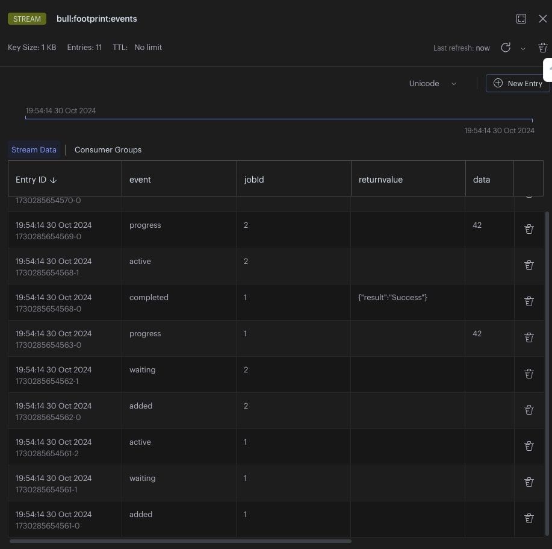

## BullMQ Events

> BullMQ Docs
>
>
> All classes in BullMQ emit useful events that inform on the lifecycles of the jobs that are running in the queue. Every class is an `EventEmitter` and emits different events.
>

BullMQ 공식문서의 Events 칸을 확인해 보면 BullMQ의 모든 클래스는 `EventEmitter` 클래스를 상속받는다고 말한다. 실제로 코드를 확인해보면 `NodeJS.EventEmitter` 클래스를 상속받거나, 이를 한번 상속받은 `QueueBase` 클래스를 상속받는 경우가 대부분이다.

하지만 실제로 이런 이벤트를 적극적으로 사용하는 클래스는 `Queue`, `Worker`, `QueueEvent` 정도에 한정되어 있다. 이들은 실제로 이벤트를 적극적으로 사용할 수 있는 메서드를 제공하며, 이러한 이벤트를 이용해서 작업들의 상태, 큐의 상태 변화를 감지해서 처리할 수 있다.

이들의 이벤트들은 공식문서에서 말한 것 같이 모두 Nodejs의 `EventEmitter` 의 메서드를 오버라이딩해서 구현해 두었다. 이번 글에서는 각각 `Queue`와 `Worker`에서 이벤트의 처리 방식에 대해서 뜯어보고, 그것을 모두 통합해서 처리하는 `QueueEvent`는 어떻게 이벤트를 처리하는지에 대해서 코드와 함께 내부 구현과 함께 글을 작성해보려고 한다.

## Queue & Worker

`Queue`와 `Worker`는 모두 `QueueBase` 클래스를 상속받는다. 그리고 `QueueBase`의 시그니처는 다음과 같다.

```ts
export class QueueBase extends EventEmitter implements MinimalQueue 
```

즉 이 둘은 모두 NodeJS의 `EventEmitter`에 의존한다. 실제로 두 클래스에 속해있는 메서드를 확인해보면 on, off, emit등의 메서드들을 오버라이딩 한 것을 확인할 수 있다.

**Worker on method**

```ts
on<U extends keyof WorkerListener<DataType, ResultType, NameType>>(
  event: U,
  listener: WorkerListener<DataType, ResultType, NameType>[U],
): this {
  super.on(event, listener);
  return this;
}

```

실제로 worker의 on method의 코드를 가져와봤다. 단순히 super.on()을 호출하여 nodeJS의 이벤트에 넘긴다는 사실을 알 수 있다. 그런다면 굳이 오버라이딩을 한 이유는 타입을 검사하기 위해서로 보인다.

이에 대해서 설명하기 위해서는 `WorkerListener` 객체를 살펴봐야 한다.

```ts
export interface WorkerListener<
  DataType = any,
  ResultType = any,
  NameType extends string = string,
> extends IoredisListener {

  active: (job: Job<DataType, ResultType, NameType>, prev: string) => void;
  closed: () => void;
  closing: (msg: string) => void;
  completed: (
    job: Job<DataType, ResultType, NameType>,
    result: ResultType,
    prev: string,
  ) => void;
  
   ... 
   
  resumed: () => void;
  stalled: (jobId: string, prev: string) => void;
}

```

on method의 U 타입은 `WorkerListener` 클래스의 키의 집합이 된다. 즉 active, resumed 등등의 값들만 U에 들어갈 수 있게 된다. 그러면 event 파라미터에 들어갈 수 있는 리터럴 타입들은 `WorkerListener` 의 키 값들로만 한정이 된다. listener 파라미터도 마찬가지이다. `WorkerListener[U]` 라는 것은 U 이벤트에 해당하는 함수 시그니처를 가르키게 된다. 예를 들어서 U타입이 resumed라면 리스터로 들어올 수 있는 함수는 `() ⇒ void` 타입을 가져야 한다는 의미이다.

이런식으로 Worker, Queue, QueueEvent 모두 각자 받을 수 있는 이벤트 타입을 정의하고 그에 대한 리스너의 타입도 정의한다.

### When to use

`Worker`과 `Queue`를 같이 설명하고, `QueueEvent`를 따로 설명하는 이유는 이벤트가 전달되는 방식이 다르기 때문이다. `Worker`, `Queue`는 모두 로컬에서 일어나는 이벤트, 즉 해당 인스턴스에서 일어나는 이벤트만 받을 수 있다.

예를 들어서, 하나의 `Queue`에 여러개의 `Worker`들이 등록될 수 있는데 이 경우에 이벤트를 이용해서 `Worker`에서 작업을 처리하는데 발생하는 이벤트를 확인하려고 해보면 다음과 같다.

```ts
const queue = new Queue('footprint', {
    connection: {
        host: 'localhost',
        port: 10001
    }
});

const worker1 = new Worker('footprint', async (job) => {
    console.log(`Processing job with id ${job.id}`);
    return { result: 'Success' };
}, {
    connection: {
        host: 'localhost',
        port: 10001
    }
});
  
const worker2 = new Worker('footprint', async (job) => {
      console.log(`Processing job with id ${job.id}`);
      return { result: 'Success' };
  }, {
      connection: {
          host: 'localhost',
          port: 10001
      }
  });
  
worker1.on('completed', (job) => {
    console.log(`Job completed with result ${job.returnvalue}`);
});
```

이렇게 코드를 작성하면 worker1에 처리한 작업에 대해서는 이벤트로 확인할 수 있지만, worker2가 처리한 작업은 이벤트로 확인할수 없이 또 만들어야 한다. 이런 문제를 해결하기 위해서 하나의 queue와 그와 연결된 모든 worker에 관련된 이벤트를 한곳에서 받아서 처리하기 위해서 `QueueEvent` 클래스를 사용할 수 있다.

### How it works

사실 작동방식은 간단하다. 각각 코드들을 자세히 살펴보면 아래와 같은 코드조각을 종종 살펴볼수 있다.

`*this*.emit('completed', job, result, 'active');`

즉, `Worker`나 `Queue`가 직접 본인이 이벤트를 생성한다. 그 후에는 `NodeJS EventEmitter`가 작동하는 것과 같으므로 각 인스턴스에서 on 메서드로 이벤트를 받을 수 있다 .

## QueueEvent

QueueEvent는 Worker와 Queue에서 발생한 이벤트들을 한번에 받아서 처리하기 위해서 나온 클래스이다. 현재 기준 공식문서에서는 다음과 같이 적혀있다

> BullMQ Docs
>
>
> The events above are local for the workers that actually completed the jobs. However, in many situations you want to listen to all the events emitted by all the workers in one single place. For this you can use the [`QueueEvents`](https://github.com/taskforcesh/bullmq/blob/master/docs/gitbook/api/bullmq.queueevents.md) class:
>

이 내용만 보면 단순히 Worker들에서의 이벤트만 받을 수 있는 것처럼 나와있지만, 코드를 뜯어보면 Queue에서 발생하는 이벤트들도 모두 받을 수 있도록 되어있고 실제로 사용해보면 정상적으로 작동한다. 그렇다면 이제부터 `QueueEvent`가 어떻게 작동하는지 코드를 뜯어보면서 함께 살펴보자.

`QueueEvent`는 대략적으로 아래 그림과 같은 방식으로 작동한다.


먼저 (1)에서 Queue나 Worker에서 발생한 이벤트를 Redis stream으로 작성한다. 그리고 (2) QueueEvent에서는 그 stream을 지켜보고 있다가 이벤트를 받아서 처리한다.

얼핏 보면 간단해 보이지만, 코드와 함께 더 자세히 살펴보도록 하겠다. 둘 중에 뭘 해도 근본적으로 작동방식은 같으므로 그냥 `Queue`의 waiting 이벤트가 어떻게 전달되는지를 예시로 들도록 하겠다.

**(1) Queue, Worker writing event to redis stream**

`Queue` 와 `Worker` 모두 공통점이 있는데 실제로 Redis에서 작업을 처리할 때는 ts로 컴파일된 lua script를 실행한다. 예를 들어서 `queue.add()`를 실행시킨다고 해보자. add method가 실행되어서 Job이 성공적으로 등록되었을 경우 waiting 이벤트가 발생하게 된다.

아래 코드는 queue.add() 메서드가 실행되었을 때 궁극적으로 실행되는 코드이다.

```ts
return this.execCommand(client, 'addStandardJob', keys);
```

`execComamnd`는 ts로 바뀐 lua 스크립트를 실행하는 함수이다. 그렇다면 addStandardJob.lua를 한번 확인해 보도록 하자

```lua
local pushCmd = opts['lifo'] and 'RPUSH' or 'LPUSH'
addJobInTargetList(target, KEYS[8], pushCmd, isPausedOrMaxed, jobId)

-- Emit waiting event
rcall("XADD", eventsKey, "MAXLEN", "~", maxEvents, "*", "event", "waiting",
      "jobId", jobId) --- [1]

-- Check if this job is a child of another job, if so add it to the parents dependencies
if parentDependenciesKey ~= nil then
    rcall("SADD", parentDependenciesKey, jobIdKey)
end

```

해당 부분은 lua script의 일부분을 가져온 것이다. 확인해보면 [1]번 부분에 있는 것이 정해진 이벤트 키에 waiting 이라는 이벤트를 추가하는 것을 볼 수 있다. 이때 키 값은 **bull:{queue_name}:events** 형태이다.

실제로 Redis Insight를 통해 살펴보면 이벤트들이 Stream 자료구조에 들어온 것을 확인할 수 있다.



**(2) Read redis stream on QueueEvent**

그 다음은 QueueEvent에서 이벤트를 소비하는 과정이다.

```ts
constructor(
  name: string,
  { connection, autorun = true, ...opts }: QueueEventsOptions = {
    connection: {},
  },
  Connection?: typeof RedisConnection,
) {

  ... 
  
  if (autorun) {
    this.run().catch(error => this.emit('error', error));
  }
}
```

`QueueEvent`에서 일부를 코드를 발췌했다. 확인해보면 `QueueEvent`에서 autorun 속성을 true로 하면 자동으로 run을 실행하는 것을 볼 수 있다. 이때 run을 false로 하면 수동으로 나중에 run을 실행할 수 있다.

```ts
  async run(): Promise<void> {
    if (!this.running) {
      try {
        this.running = true;
        const client = await this.client;

        // TODO: Planed for deprecation as it has no really a use case
        try {
          await client.client('SETNAME', this.clientName(QUEUE_EVENT_SUFFIX));
        } catch (err) {
          if (!clientCommandMessageReg.test((<Error>err).message)) {
            throw err;
          }
        }

        await this.consumeEvents(client); // ---[1]
      } catch (error) {
        this.running = false;
        throw error;
      }
    } else {
      throw new Error('Queue Events is already running.');
    }
  }
```

run 메서드를 보면 나머지는 다 넘기고 [1]번에 consumeEvents가 있다. 여기서 직접 이벤트를 소비하는 코드가 동작하게 된다.

```ts
while (!this.closing) {
  // Cast to actual return type, see: https://github.com/DefinitelyTyped/DefinitelyTyped/issues/44301
  const data: StreamReadRaw = await this.checkConnectionError(() => {
    return client.xread('BLOCK', opts.blockingTimeout!, 'STREAMS', key, id); // --[1]
  });

  if (data) {
    const stream = data[0];
    const events = stream[1];

    for (let i = 0; i < events.length; i++) {
      id = events[i][0];
      const args = array2obj(events[i][1]);

      //
      // TODO: we may need to have a separate xtream for progress data
      // to avoid this hack.
      switch (args.event) {
        case 'progress':
          args.data = JSON.parse(args.data);
          break;
        case 'completed':
          args.returnvalue = JSON.parse(args.returnvalue);
          break;
      }

      const { event, ...restArgs } = args;

      if (event === 'drained') {  // ---[2]
        this.emit(event, id);
      } else {
        this.emit(event as any, restArgs, id);
        this.emit(`${event}:${restArgs.jobId}` as any, restArgs, id);
      }
    }
  }
}
```

이 코드는 consumeEvents 메서드에서 직접 이벤트를 받아와서 소비하는 코드이다. 주목해야 하는 부분은 [1]번의 `return client.xread('BLOCK', opts.blockingTimeout!, 'STREAMS', key, id);` 이다. 이 부분에서 보면 BLOCK으로 연결을 하고 있는 것을 볼 수 있다. `QueueEvent`는 기본적으로 Redis Stream 을 이용하기 때문에 Bloking하게 연결을 해야한다. 그래서 나중에 확인해보면 알겠지만 redis client를 생성하는 옵션에도 blocking 옵션이 true로 되어 있다.

만약에 제대로 스트림에서 데이터가 들어오면 그 데이터를 가져와서 [2]번에 있는 함수에서 직접 emit처리를 한다. `QueueEvent`객체도 `QueueBase`  클래스를 상속하기 때문에 this.emit이 실행되면 실제로 NodeJS의 `EventEmitter`가 동작하게 되어 on으로 이벤트를 받아볼 수 있다.

## Summary

`QueueEvent` 는 Redis Stream을 이용해서 이벤트를 받아온다. 그 과정에서 Blocking connection을 이용한다. 반면에 `Queue`, `Worker` 같은 경우는 Non-Blocking connection을 이용해 재사용 할 수 있으며, 이벤트를 발생시키는 역할을 한다. 이때 직접 본인이 emit함과 동시에, redis의 **bull:{queue_name}:events** 를 키로 해서 이벤트 정보를 작성한다.